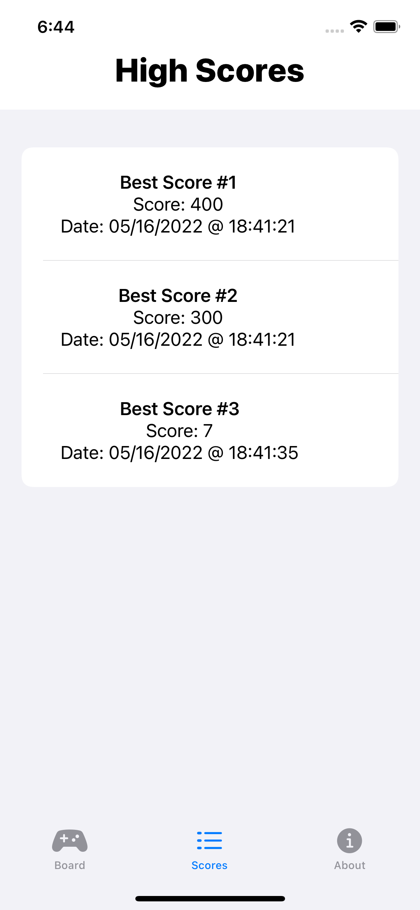
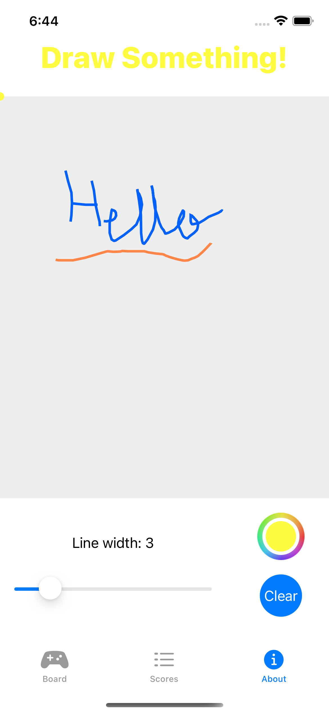

# Threes Game (iOS)

## Goal 
In this project the goal was to recreate a game that has similiar gameplay and concept as 'Threes' from the App Store. 
- Game logic 
- Gestures on the game board
- Saving game play data and keeping a scoreboard 
- Integrating user-friendly UI 
- Horizontal and Vertical modes 
- Making an extra minigame/animation (Drawing Canvas) 

## Screenshots 

